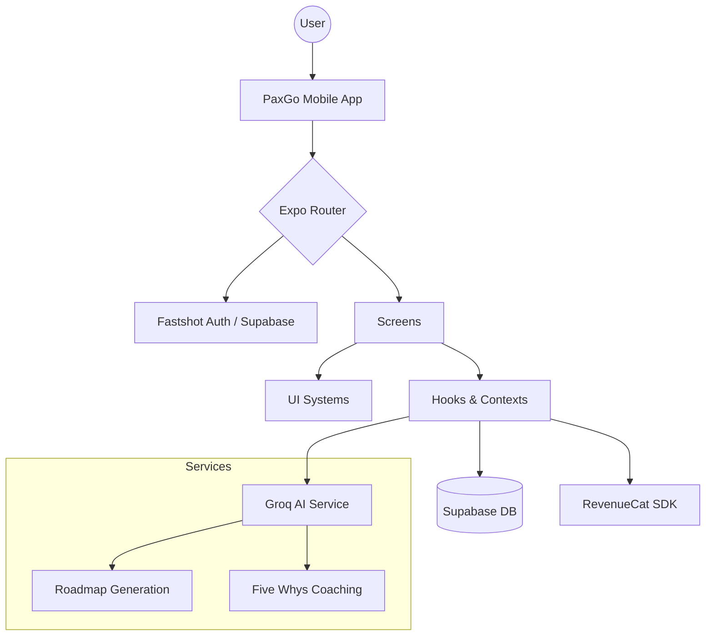

# Technical Documentation: PaxGo

## 1. Overview

PaxGo is a cross-platform mobile application designed to help users transform overwhelming "Big Dreams" into actionable "Micro-actions." It leverages AI-driven coaching and social validation to sustain long-term motivation.

## 2. Technology Stack

- **Frontend**: React Native via Expo (SDK 54)
- **Routing**: Expo Router (File-based routing)
- **Styling**: Vanilla CSS / React Native StyleSheet (Luxury Dark Theme)
- **Database & Auth**: Supabase
- **AI Processing**: Groq SDK (Llama 3 70B / 8B)
- **Subscription Management**: RevenueCat
- **Animations**: React Native Reanimated, Lottie, Expo Haptics

## 3. System Architecture

## 4. Core Modules

### 4.1 AI Service (`services/aiService.ts`)

The AI engine decomposes high-level goals into a nested structure:

1. **Dream**: The high-level objective.
2. **Phases**: Logical milestones.
3. **Micro-actions**: Small tasks (5-15 mins) with concrete outcomes.

### 4.2 Auth Flow (`@fastshot/auth`)

A convention-based authentication bridge between Expo and Supabase, supporting:

- Email/Password
- Google & Apple OAuth
- Deep-link redirection (`paxgo://auth/callback`)

### 4.3 Roadmap Context (`contexts/RoadmapContext.tsx`)

Manages the lifecycle of user dreams:

- Synchronizes local UI state with Supabase `action_roadmaps` and `milestones`.
- Handles optimistic updates for marking actions as complete.

## 5. Database Schema (Partial)

- `users`: Profile and onboarding status.
- `dreams`: Metadata for the user's primary goals.
- `action_roadmaps`: The AI-generated steps.
- `hypes`: Community-shared milestones.
- `proofs`: User-uploaded media/signatures for verification.

## 6. Infrastructure & Deployment

- **Build System**: EAS Build (Managed Workflow)
- **Store Distribution**: Android App Bundle (.aab) for Google Play.
